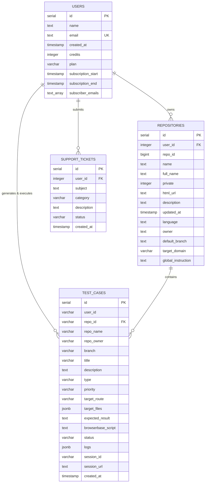

# 🗄️ Database Schema & Architecture Specification

> **Project**: AI Testing Automation Platform (`ai-testing-automation`)  
> **Database Engine**: PostgreSQL 15+ (Neon Serverless PostgreSQL `@neondatabase/serverless`)  
> **ORM**: Drizzle ORM (`drizzle-orm`, `drizzle-kit`)  
> **Authentication**: Clerk Auth integrated with Neon `users` table auto-sync  

---

## 📐 Entity-Relationship Diagrams

### 1. Mermaid ER Diagram



---

### 2. ASCII Architectural Schema Map

```
+-----------------------------------------------------------------------------------+
|                                     USERS                                         |
|  id (PK) | name | email (UK) | credits | plan | subscriberEmails | createdAt      |
+-----------------------------------------------------------------------------------+
       |                                      |                                  |
       | 1:N                                  | 1:N                              | 1:N
       v                                      v                                  v
+-----------------------+          +-----------------------+          +-----------------------+
|     REPOSITORIES      |          |      TEST_CASES       |          |    SUPPORT_TICKETS    |
+-----------------------+          +-----------------------+          +-----------------------+
| id (PK)               |          | id (PK)               |          | id (PK)               |
| userId (FK -> users)  |          | userId (varchar)      |          | userId (FK -> users)  |
| repoId (bigint)       |<-------- | repoId (varchar)      |          | subject               |
| name                  |          | repoName              |          | category              |
| fullName              |          | title, description    |          | description           |
| owner, defaultBranch  |          | type, priority        |          | status                |
| targetDomain          |          | targetRoute           |          | createdAt             |
| globalInstruction     |          | targetFiles (jsonb)   |          +-----------------------+
| updatedAt             |          | browserbaseScript     |
+-----------------------+          | status, logs (jsonb)  |
                                   | sessionId, sessionUrl |
                                   | createdAt             |
                                   +-----------------------+
```

---

## 📊 Detailed Table Specifications

### 1. `users` Table
Stores registered user profile data, subscription plans, and credit balances.

| Column Name | Data Type | Constraints / Attributes | Description |
| :--- | :--- | :--- | :--- |
| `id` | `SERIAL` | `PRIMARY KEY` | Internal unique User ID |
| `name` | `TEXT` | `NULLable` | User full name |
| `email` | `TEXT` | `NOT NULL`, `UNIQUE` | User email address (synced with Clerk) |
| `created_at` | `TIMESTAMP` | `NOT NULL`, `DEFAULT NOW()` | User registration timestamp |
| `credits` | `INTEGER` | `NOT NULL`, `DEFAULT 1000` | Current available AI scan & execution credits |
| `plan` | `VARCHAR(50)` | `NOT NULL`, `DEFAULT 'free'` | Active plan (`free`, `starter`, `pro`) |
| `subscription_start`| `TIMESTAMP` | `NULLable` | Active subscription start date |
| `subscription_end` | `TIMESTAMP` | `NULLable` | Active subscription expiry date |
| `subscriber_emails`| `TEXT[]` | `NOT NULL`, `DEFAULT '[]'` | Array of subscriber contact emails |

---

### 2. `repositories` Table
Stores connected GitHub repositories and custom AI instructions.

| Column Name | Data Type | Constraints / Attributes | Description |
| :--- | :--- | :--- | :--- |
| `id` | `SERIAL` | `PRIMARY KEY` | Internal unique Repository Record ID |
| `user_id` | `INTEGER` | `NOT NULL`, `REFERENCES users(id)` | Owning user FK |
| `repo_id` | `BIGINT` | `NOT NULL` | GitHub numeric repository ID |
| `name` | `TEXT` | `NOT NULL` | Repository name (e.g., `ai-testing-automation`) |
| `full_name` | `TEXT` | `NOT NULL` | Owner and repository name (e.g., `owner/repo`) |
| `private` | `INTEGER` | `NOT NULL` | Privacy flag (`0` = Public, `1` = Private) |
| `html_url` | `TEXT` | `NOT NULL` | GitHub repository web URL |
| `description` | `TEXT` | `NULLable` | Repository description |
| `updated_at` | `TIMESTAMP` | `NULLable` | GitHub last updated timestamp |
| `language` | `TEXT` | `NULLable` | Primary programming language |
| `owner` | `TEXT` | `NOT NULL` | Repository owner username |
| `default_branch` | `TEXT` | `NOT NULL` | Default branch (e.g., `main`, `master`) |
| `target_domain` | `VARCHAR` | `DEFAULT 'http://localhost:3000/'`| Target URL for Playwright execution |
| `global_instruction`| `TEXT` | `NULLable` | Custom system prompt for Gemini AI test generation |

---

### 3. `test_cases` Table
Core entity storing generated test specifications, AI Playwright scripts, and cloud execution logs.

| Column Name | Data Type | Constraints / Attributes | Description |
| :--- | :--- | :--- | :--- |
| `id` | `SERIAL` | `PRIMARY KEY` | Internal unique Test Case ID |
| `user_id` | `VARCHAR(255)` | `NOT NULL` | Scoped user identifier |
| `repo_id` | `VARCHAR(255)` | `NULLable` | Associated GitHub repository ID |
| `repo_name` | `VARCHAR(255)` | `NOT NULL` | Associated repository name |
| `repo_owner` | `VARCHAR(255)` | `NOT NULL` | Associated repository owner |
| `branch` | `VARCHAR(100)` | `DEFAULT 'main'` | Target git branch |
| `title` | `VARCHAR(500)` | `NOT NULL` | Test case headline title |
| `description` | `TEXT` | `NOT NULL` | Detailed step-by-step test objective |
| `type` | `VARCHAR(100)` | `NOT NULL` | Category (e.g., `UI Test`, `Auth Flow`, `API`) |
| `priority` | `VARCHAR(50)` | `NOT NULL` | Priority tier (`High`, `Medium`, `Low`) |
| `target_route` | `VARCHAR(500)` | `NULLable` | Target page route (e.g., `/dashboard`) |
| `target_files` | `JSONB` | `DEFAULT '[]'` | Array of relevant source code file paths |
| `expected_result` | `TEXT` | `NULLable` | Expected browser outcome |
| `browserbase_script`| `TEXT` | `NULLable` | Generated Playwright TypeScript code |
| `status` | `VARCHAR(100)` | `DEFAULT 'generated'` | State (`generated`, `running`, `passed`, `failed`) |
| `logs` | `JSONB` | `DEFAULT '[]'` | Array of browser console logs & execution steps |
| `session_id` | `VARCHAR(255)` | `NULLable` | Browserbase cloud browser session ID |
| `session_url` | `TEXT` | `NULLable` | Live view / video recording URL |
| `created_at` | `TIMESTAMP` | `DEFAULT NOW()` | Generation timestamp |

---

### 4. `support_tickets` Table
Stores customer support requests.

| Column Name | Data Type | Constraints / Attributes | Description |
| :--- | :--- | :--- | :--- |
| `id` | `SERIAL` | `PRIMARY KEY` | Unique Ticket ID |
| `user_id` | `INTEGER` | `NOT NULL` | Owning user FK |
| `subject` | `TEXT` | `NOT NULL` | Support subject line |
| `category` | `VARCHAR(100)` | `NOT NULL` | Issue category (`Billing`, `Bug`, `Feature`) |
| `description` | `TEXT` | `NOT NULL` | Detailed problem description |
| `status` | `VARCHAR(50)` | `NOT NULL DEFAULT 'open'` | Status (`open`, `resolved`, `closed`) |
| `created_at` | `TIMESTAMP` | `NOT NULL DEFAULT NOW()` | Submission timestamp |

---

## 🔗 Relationships & Foreign Key Matrix

| Source Table | Source Foreign Key | Target Table | Target Primary Key | Relationship Type | Business Purpose |
| :--- | :--- | :--- | :--- | :--- | :--- |
| `repositories` | `user_id` | `users` | `id` | `1:N` | Links repo settings to user account |
| `support_tickets` | `user_id` | `users` | `id` | `1:N` | Links support tickets to user account |
| `test_cases` | `repo_id` | `repositories` | `repo_id` | `1:N` | Groups test cases under repository |
| `test_cases` | `user_id` | `users` | `id` | `1:N` | Scopes test cases to user account |

---

## 🧮 Mathematical Invariants & Credit Formulas

1. **Test Generation Credit Deduction**:
   $$\text{Remaining Credits} = \text{Current Credits} - 10$$

2. **Test Execution Credit Deduction**:
   $$\text{Remaining Credits} = \text{Current Credits} - 20$$

3. **Pass Rate Calculation**:
   $$\text{Pass Rate (\%)} = \left( \frac{\text{Passed Test Cases}}{\text{Total Executed Test Cases}} \right) \times 100$$

---

## ⚡ Performance & Drizzle ORM Queries

```typescript
// 1. Fetch user repositories with Drizzle
const userRepos = await db.select().from(repositories)
  .where(eq(repositories.userId, user.id));

// 2. Fetch test cases with target route filtering
const testCases = await db.select().from(TestCasesTable)
  .where(and(eq(TestCasesTable.userId, String(user.id)), eq(TestCasesTable.repoName, repoName)));

// 3. Atomically decrement user credits
await db.update(users)
  .set({ credits: user.credits - cost })
  .where(eq(users.id, user.id));
```
